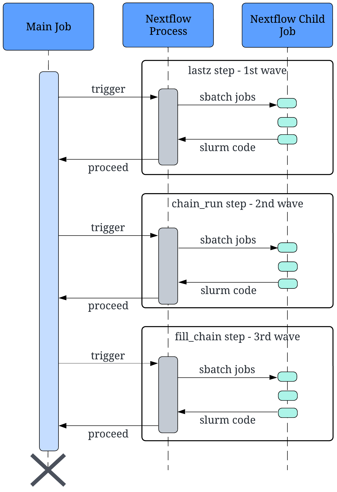
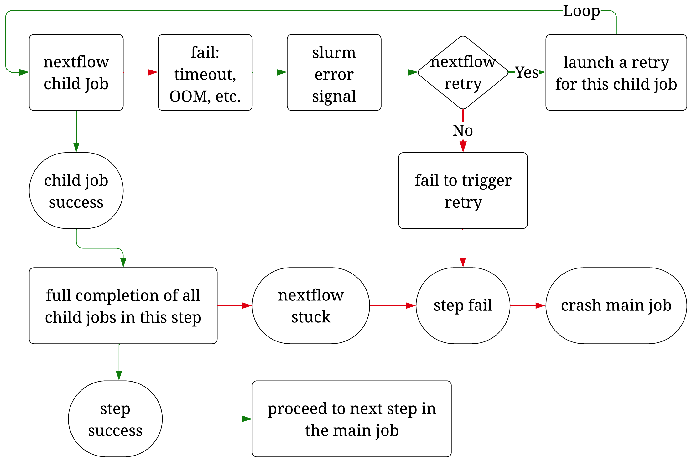
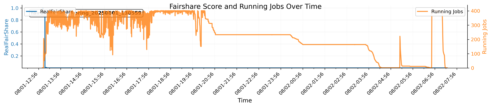
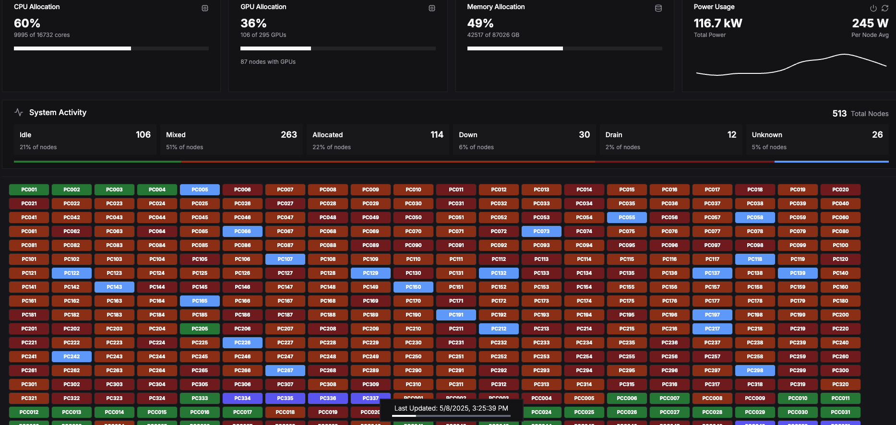
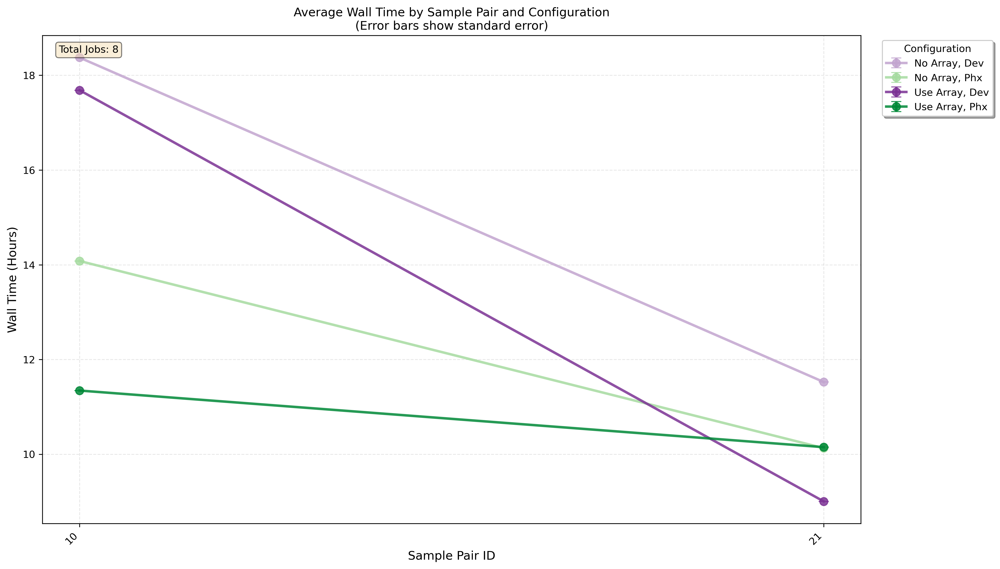
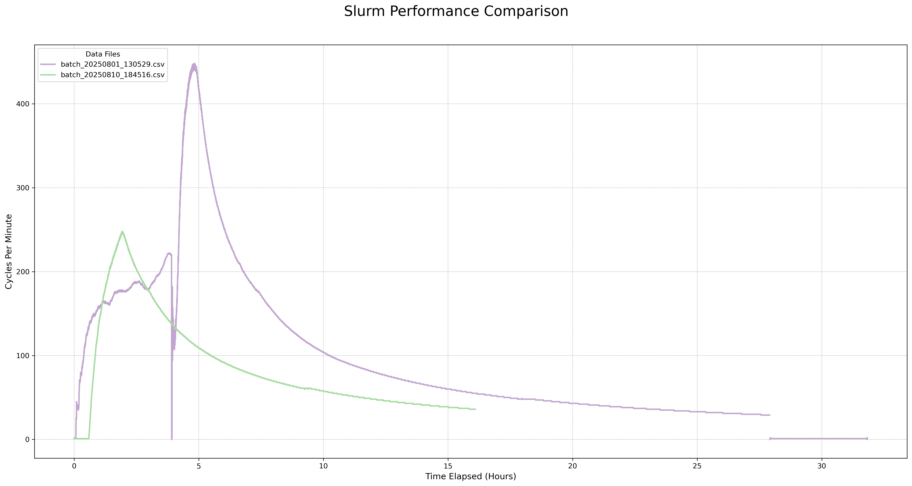

## Nextflow on a shared HPC Cluster

Nextflow acts as a middle layer between the user and the job scheduler Slurm. 

Below is an example for how a multi-step Nextflow-based workflow interacts with Slurm.
(source: USRSE'25 paper, link coming soon!)




## Problems

1. Rapid fairshare score consumption & difficulty of backfilling child jobs
    
    → increased waiting time
    
    → increased time for the main job
    
    → main job crashes due to timeout
    

1. Intolerance of the child job failures
    
    → main job crashes

   Below is an example for how a child job can crash the main job (many ways).

   


## Solution / Best Practices

1. Reduce child job size (time, memory, cores)
    1. Similar to finding the appropriate amount of resources for a job
    2. `seff`
  
   Because the fairshare score will drop to zero very fast, so the child jobs have to use the backfilling mechanism of Slurm.
   
   
   
   
3. Retry mechanism
    1. Retry on the `140` error code for “not enough resources”
    2. Retry 3 times regardless of the error code
4. Dynamic resource allocation
    1. Retry with more resources
5. Enable the report & job array feature
    1. Produce job statistics reports for each job step → help #1
    2. Submit child jobs in batches of job arrays
6. Gracefully end the failed child jobs
7. Consider Phx for CPU-intensive workflow
   Below is a screenshot of the Phx supercomputer when an efficient Nextflow workflow was running and taking up most of the public CPU nodes.
   
   


## Benchmarking Results for using or not using the Job Array feature

Below is the total job walltime measured on the main job.



Below is the slurm stress level (slurm cycles) on a private cluster:
    - purple line: without job array
    - green: with job array
    



## Coding Example

Using `nextflow.config` to control the workflow settings:

1. Edit the config file directly
2. Use a Python wrapper to generate a config file

```
// Nextflow config for lastz jobs
executor {
   queueSize = 2000         # default is 100 for grid executor like slurm
   retry.maxAttempt = 3     # default is 3
   killBatchSize = 1000000  # default is 100 for slurm
}

process {
    executor = 'slurm'
    memory = { 16.GB * task.attempt }
    time = { 1.hour * task.attempt }
    queue = 'public'
    cpus = 1
    array = 2000
    maxRetries = 5
    errorStrategy = 'retry'
    maxErrors = '-1'
}
```
