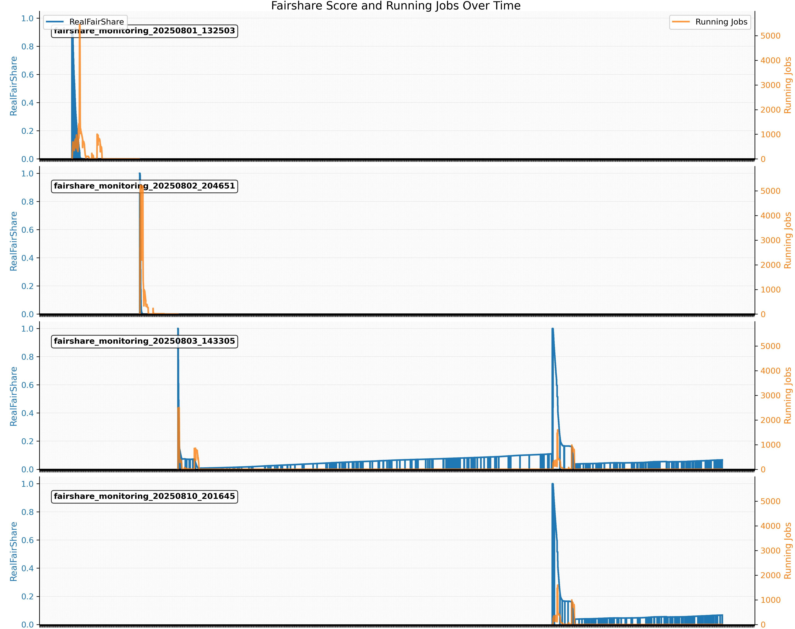

## Nextflow on a shared HPC Cluster

Nextflow acts as a middle layer between the user and the job scheduler Slurm. Nextflow v24.04.0 and newer offers native support for job arrays for grid schedulers, but it's an "experimental" feature as stated on their doc and still under development.

Terms:
- Process vs. Task
- Main job vs. Child job
- Job array, main job vs. Sub job, array job

Below is an example of how a multi-step Nextflow-based workflow interacts with Slurm.
Source: [USRSE'25 paper](https://zenodo.org/records/17118383)


## Problems

1. Rapid fairshare score consumption & difficulty of backfilling child jobs
    
    → increased waiting time
    
    → increased time for the main job
    
    → main job crashes due to timeout

   Because the fairshare score will drop to zero very fast, so the child jobs have to use the backfilling mechanism of Slurm.



    

2. Intolerance of the child job failures
    
    → main job crashes

   Below is an example of how a child job can crash the main job (many ways).


## Solution / Best Practices

1. Reduce child job size (time, memory, cores)
- Similar to finding the appropriate amount of resources for a job/ job array
- `seff`


2. Retry mechanism
- Retry on the `140` error code for “not enough resources”
- Retry 3 times regardless of the error code


3. Dynamic resource allocation
- Retry with more resources


4. Enable the report & job array feature
- Produce job statistics reports for each job step → help #1
- Submit child jobs in batches of job arrays


5. Gracefully end the child jobs
- Send the end [signal](https://slurm.schedmd.com/sbatch.html) before the due time
- Usually default, but the [clusterOptions](https://www.nextflow.io/docs/latest/reference/process.html#clusteroptions) param can cause problem.


6. Reduce queueSize and array size during test runs


7. Consider Phx for CPU-intensive workflow
   
   Below is a screenshot of the Phx supercomputer when an efficient Nextflow workflow was running and taking up most of the public CPU nodes.
   


## Benchmarking Results for using or not using the Job Array feature

1. Below is the total job walltime measured on the main job.


2. Below is the slurm stress level (slurm cycles) on a private cluster:

- purple line: without job array
    
- green: with job array
    


## Coding Example

Using `nextflow.config` to control the workflow settings:

1. Edit the config file directly
2. Use a Python wrapper to generate a config file

```groovy
// Nextflow config for lastz jobs
executor {
    queueSize = 10000                     // default: 100, how many living jobs (pending or running) slurm will hold all the time for a main job. Nextflow dev is working on fixing some small bugs around this parameter.
    retry.maxAttempt = 3                  // default: 3, for slurm to resubmit any jobs.
    killBatchSize = 1000000               // default: 100
}

process {
    executor = 'slurm'                    // using "local" on a single node will mimic the workstation setting      
    memory = { 4.GB * task.attempt }      // dynamic allocation
    time = { 1.hour * task.attempt }      // dynamic allocation
    queue = 'public'
    cpus = 1
    array = 2000                          // how many sub-jobs a job array will hold, must be int, cannot be a variable
    maxRetries = 5                        // for nextflow to retry a child job.
    errorStrategy = 'retry'
    maxErrors = '-1'                      // total errors a job step can have, "-1" to be unlimited
    clusterOptions = '--signal=USR2@180'  // early stop
}
```


3. How to calculate the queueSize and the array size

```
Phx cluster

public/public, pc[005-337]
total CPU = 333*28 = 9324 --> queueSize = 10000
memory per node --> can support the queueSize
	122G/4 = 30 jobs, 30 jobs * 293 = 8790 jobs
	249G/4 * 36 = 62 * 36 = 2232 jobs
	184G/4 * 4 = 46 * 4 = 184 jobs
Array size = 2000
```


## Related Links

[USRSE'25 paper](https://zenodo.org/records/17118383)

[Implementation of make_lastz_chains on the Phx cluster](https://github.com/NilaBlueshirt/make_lastz_chains_onPhx)

[Nextflow official training doc](https://training.nextflow.io/latest/nextflow_run/03_config/#4-manage-workflow-parameters)

[Nextflow doc](https://www.nextflow.io/docs/latest/reference/process.html#array)
